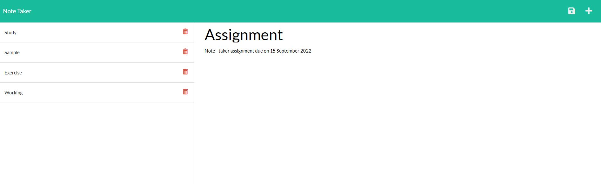

# Note-Taker

## User Story

AS A small business owner,
I WANT to be able to write and save notes, 
SO THAT I can organize my thoughts and keep track of tasks I need to complete.

## Description

The application allows user to enter note title and note text and save them using the save button.
User can open a previously created note stored in the left hand column of the page and the details will be shown on the right hand column.

Following is the link to the Heroku Deployment : https://notes-taker-jatin1211.herokuapp.com/notes

## Usage Information
The user can create/add as many notes as per their requirement.

## Screencapture

## Built using
* HTML, CSS, Javascript
* Node.js
* Express Server

## Contribution

Made by Jatin